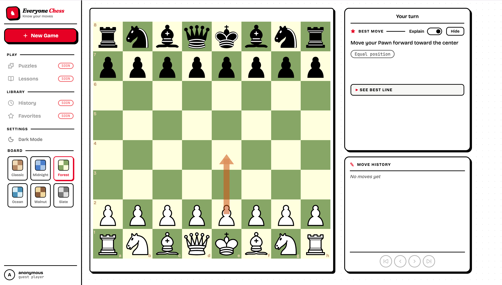

# Everyone Chess



A chess web app built with React, TypeScript, and Vite. Play against a Stockfish-powered AI or share a board for a local two-player game.

## Features

- **Play vs. Computer** — Stockfish opponent with three difficulty levels:
  - Easy (~400 Elo)
  - Medium (~1500 Elo)
  - Hard (~2800 Elo, near-perfect play)
- **Two-Player Mode** — pass-and-play on the same device.
- **Hints** — request a Stockfish suggestion for the current position.
- **Move history** — full SAN notation with the ability to scrub back through the game.
- **Captured pieces** — live view of material taken by each side.
- **Choose your side** — play as white or black against the computer.
- **Themes**
  - Light / dark UI mode (persisted in `localStorage`).
  - Six board color schemes: Classic, Midnight, Forest, Ocean, Walnut, Slate.

## Tech Stack

- [React 19](https://react.dev/) + [TypeScript](https://www.typescriptlang.org/)
- [Vite 8](https://vite.dev/) for dev server and bundling
- [chess.js](https://github.com/jhlywa/chess.js) for game state and move validation
- [react-chessboard](https://github.com/Clariity/react-chessboard) for the board UI
- [Stockfish](https://stockfishchess.org/) (WASM) running in a Web Worker for AI moves and hints
- [lucide-react](https://lucide.dev/) for icons

## Getting Started

### Prerequisites

- Node.js 20+ (or any version that supports Vite 8)
- npm

### Install

```bash
npm install
```

### Run the dev server

```bash
npm run dev
```

Then open the URL Vite prints (typically http://localhost:5173).

### Build for production

```bash
npm run build
```

The bundled output is written to `dist/`. Preview it with:

```bash
npm run preview
```

### Lint

```bash
npm run lint
```

## Project Structure

```
src/
├── App.tsx                  # Top-level state (theme, mode, difficulty, color)
├── components/
│   ├── StartScreen.tsx      # Mode / difficulty / color selection
│   ├── MainMenu.tsx         # Top bar: new game, theme toggle, board picker
│   ├── GameBoard.tsx        # Board, move handling, side panels
│   ├── BoardThemePicker.tsx # Six-scheme color picker
│   ├── Controls.tsx         # In-game controls (hint, undo, reset, etc.)
│   ├── HintPanel.tsx        # Stockfish hint display
│   ├── MoveHistory.tsx      # SAN move list
│   └── CapturedPieces.tsx   # Captured material per side
├── context/
│   └── ThemeContext.ts      # Light/dark theme context
├── hooks/
│   ├── useChessGame.ts      # chess.js wrapper, move + status tracking
│   ├── useStockfish.ts      # Stockfish worker lifecycle and search
│   ├── useHint.ts           # Hint request flow
│   └── useTheme.ts          # Reads ThemeContext
├── utils/
│   └── chess.ts             # Helpers around chess.js
└── types.ts                 # Shared types and theme/difficulty configs
```

## How It Works

- **Game state** lives in `useChessGame`, which wraps a `chess.js` instance and exposes the move list, status (check / checkmate / draw), and helpers for making and undoing moves.
- **AI opponent** runs in `useStockfish`, which spawns Stockfish in a Web Worker and configures `UCI_LimitStrength` / `UCI_Elo` based on the selected difficulty. Hard mode runs at full strength with a longer `movetime`.
- **Hints** reuse the Stockfish worker via `useHint` to get the engine's preferred move for the current position.
- **Themes** — UI light/dark and board color scheme are both persisted in `localStorage` and applied via `data-theme` on the document root and per-board CSS variables.
